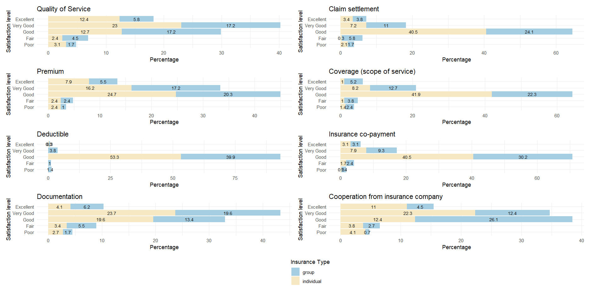

## Word Cloud from YouTube Comments on Bangladeshi Artists

{width="500px" fig-align="center"}

Word cloud generated from a preliminary corpus of YouTube comments on Bangladeshi artists. The visualization provides an initial overview of the most frequently occurring words in the dataset. The vocabulary and relative frequencies will evolve as the corpus is expanded and finalized.

---

## Global Migration Network

{width=65% fig-align="center"}

Evolution of the global migration network's core–periphery structure from 1990 to 2020. Core countries (orange) are identified using the Ma and Mondragón algorithm based on the incoming core–periphery (in-CP) measure, while peripheral countries are shown in blue. Node size represents weighted indegree (node strength). The migration system exhibits a highly persistent core, indicating that the world's principal destination countries have remained largely unchanged despite the expansion of international migration.

---

## Exporters of Cultural Products

{width=70% fig-align="center"}

Comparison of weighted outdegree centrality for exporters of unique cultural products, reproducible cultural products, and non-cultural products in 2000 and 2023. Darker shades indicate greater export centrality. The maps illustrate the evolution of global trade networks, highlighting the increasing prominence of China alongside the United States over time. While reproducible cultural products (e.g., books and recorded music) have seen the emergence of new exporters, exports of unique cultural products remain concentrated in a small number of European countries and the United States.

---

## CO₂ Embodied in International Trade

::: {.grid}

::: {.g-col-6}
**(a) Importers**

{width=100%}
:::

::: {.g-col-6}
**(b) Exporters**

{width=100%}
:::

:::

Ranking trajectories of the top 10 importers (a) and exporters (b) of CO₂ embodied in international trade. Countries are classified as advanced economies (blue) and emerging market economies (orange) according to the IMF classification. Advanced economies consistently account for approximately nine of the ten largest importers of embodied CO₂, whereas emerging market economies comprise around eight of the ten largest exporters, highlighting the geographical separation between the consumption and production of carbon-intensive goods.

---

## Measures of Health Insurance Satisfaction in Bangladesh

{width=70% fig-align="center"}

Distribution of satisfaction levels across major dimensions of health insurance services in Bangladesh, including quality of service, claim settlement, premium, coverage, deductible, insurance co-payment, documentation, and cooperation from insurance providers. The figure compares responses from individual and group insurance policyholders. Adapted from our published study in *SSM – Health Systems*.